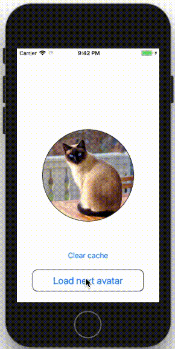

# ImagePreloader iOS

UI component to preload and cache remote images like avatars.



### Usage

```Swift
@IBOutlet weak var avatar: ImagePreloader!

override func viewDidLoad() {
    super.viewDidLoad()
    avatar.url = "https://www.cats.org.uk/media/2299/tortie-cat-looking-up.jpg"
}
```

### Configure

You can configure component from storyboard or programmatically.
```Swift
avatar.placeholder = UIImage(named: "cat")
avatar.progressColor = .blue
avatar.progressRadius = 4
avatar.circle = true
```
Scale and crop the image in a circle after loading.
```Swift
avatar.isCropCircle = true
```
You can also change the space for the cache.
```Swift
ImagePreloader.cacheMaxImages = 100
ImagePreloader.cacheMaxSize = 100_000_000
```
And set the number of retries and the time interval.
```Swift
ImagePreloader.retryCount = 10
ImagePreloader.retryInterval = 1
```
